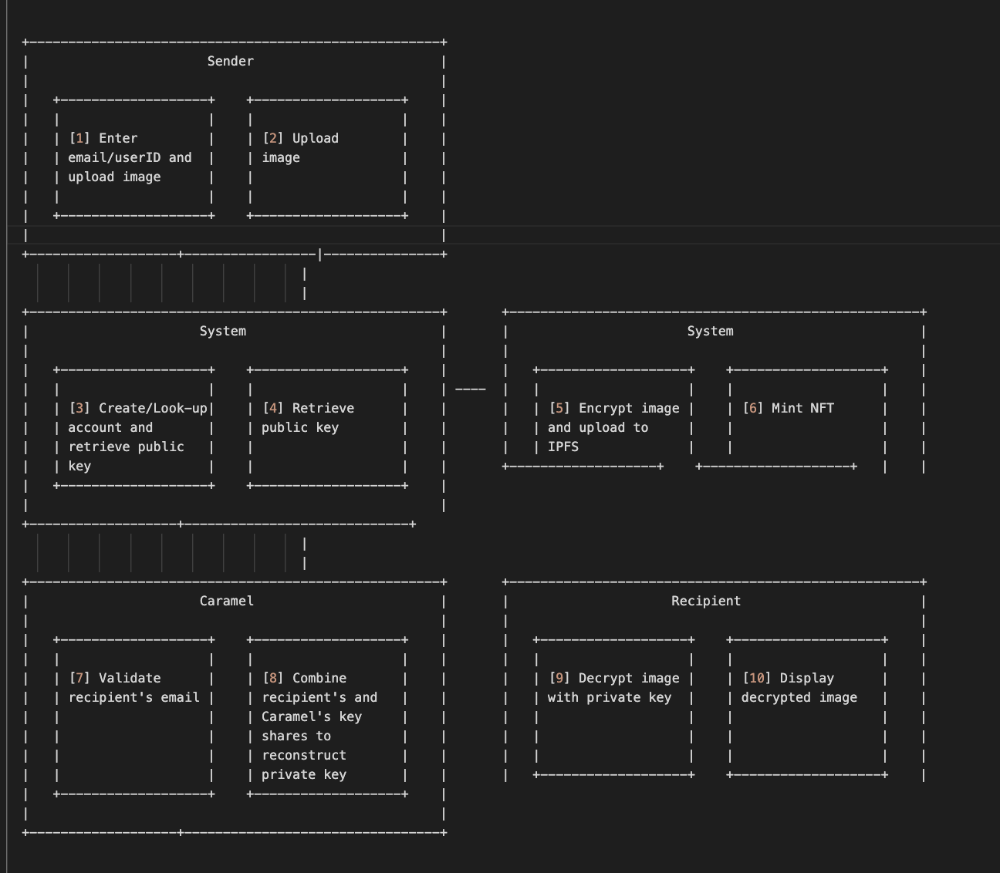

# Welcome to Caramel
  Private NFTs of medical imaging on Flow Blockchain for verifiable and traceable data consumers

## Caramel fkow

1. Sender: Enter recipient's wallet or email  or userID, and upload the image.
2. Sender: Upload image.
3. System: Create or look up the account and retrieve the recipient's public key.
4. System: Retrieve the public key.
5. System: Encrypt the image and upload it to IPFS.
6. System: Mint NFT.
7. Caramel: Validate the recipient's email.
8. Caramel: Combine the recipient's and Caramel's key shares to reconstruct the private key.
9. Recipient: Decrypt the image with the private key.
10. Recipient: Display the decrypted image.

               
            

